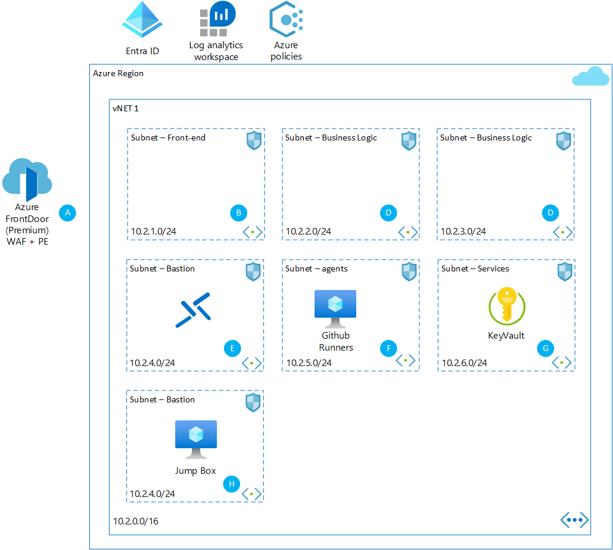

# Web Application
## Overview

## Deploy this!
*Please note that the provided deployment is an example and should be tailored to your specific needs*  
Broken - 

### Bicep deployment
[Bicep References](../references.md#bicep)
* [Bicep Template](https://github.com/marcdekeyser/refarch/blob/main/bicep/aks_cluster/main.bicep)  

### Cost
The services used in this template are subject to their normal usage fees and charges. Learn more about the cost of individual services by visiting the [Azure Pricing Calculator](https://azure.microsoft.com/en-us/pricing/calculator/).

## Design methodology
[Find more here](/Topics/designmethodology.md)

## Built on Zero Trust
[Find more here](/Topics/zerotrust.md)

## Built on network-level segmentation patterns
[Find more here](/Topics/networksegmentation.md)

## Architecture
[Visio](/Solutions/diagrams/foundation_bastion.vsdx)

### Architecture Diagram

### Traffic flow Diagram

### Components